# Important Basics of Business Analysis (BA)

## Business Process Model and Notation (BPMN)

BPMN is a standardized graphical notation used to model business processes. It provides a visual representation of the steps, decisions, and flows involved in a business process.

### Key Elements of BPMN

BPMN diagrams consist of four main element groups:

1. **Flow Objects**
2. **Connecting Objects**
3. **Artifacts**
4. **Participants**

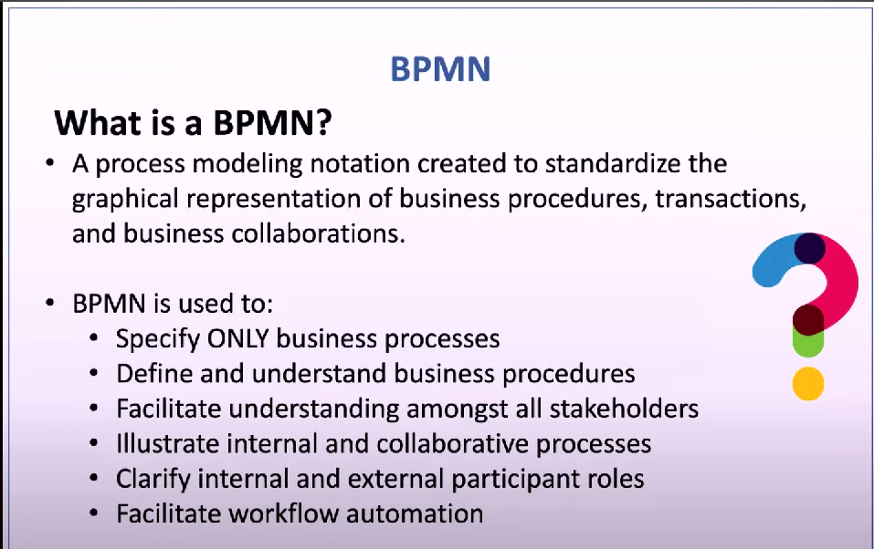

### 1. Flow Objects

Flow objects are the main elements used to define the behavior of a business process. They include:

- **Events**: Something that happens during the course of a process.
- **Activities**: Work that is performed within a process.
- **Gateways**: Decisions or branching points within a process.

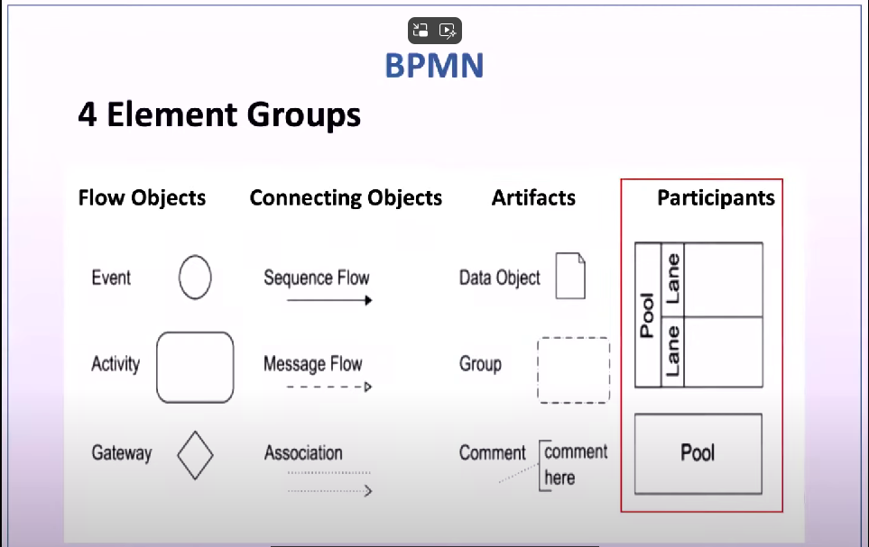

#### Events

Events are categorized into three types:

- **Start Event**: Triggers the beginning of a process.
- **Intermediate Event**: Occurs between the start and end of a process.
- **End Event**: Marks the conclusion of a process.

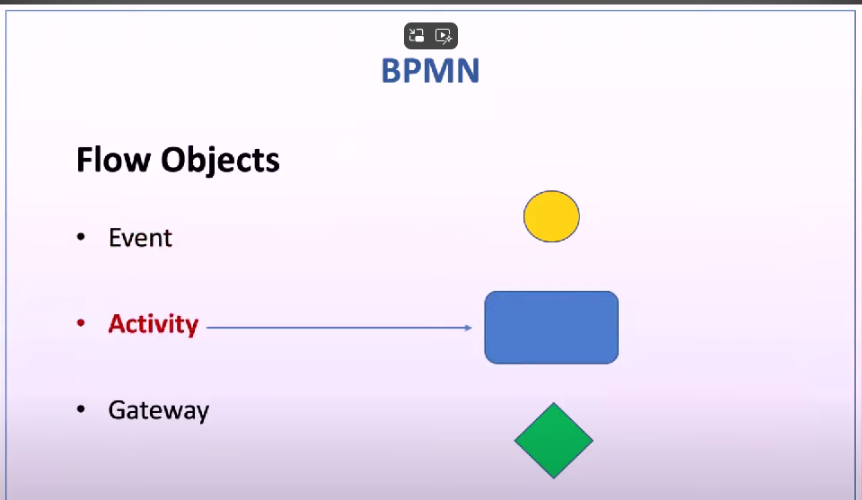
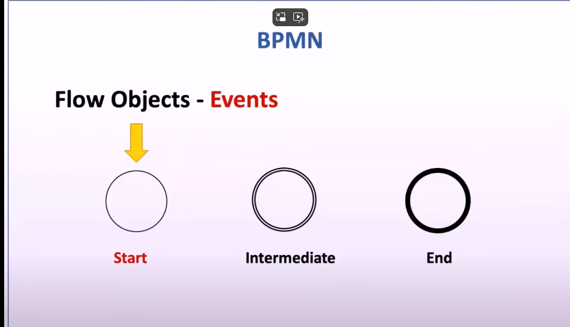

##### Types of Events

- **Message Event**: Triggered by a message.
- **Timed Event**: Triggered by a specific time or date.
- **Error Event**: Triggered by an error.
- **Cancel Event**: Triggered by a cancellation.
- **Terminate Event**: Immediately ends the process.

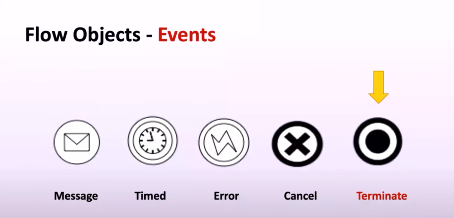

#### Activities

Activities represent work that is performed within a process. They can be:

- **Task**: A single unit of work.
- **Sub-task**: A smaller task within a larger task.

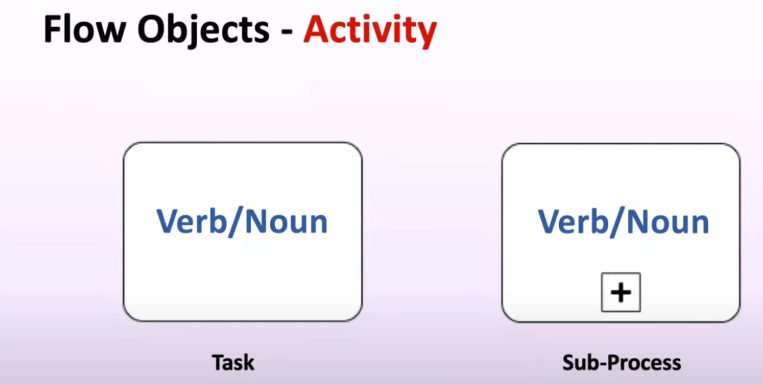

#### Gateways

Gateways control the flow of a process. They can be:

- **Exclusive Gateway**: Only one path can be taken.
- **Event-Based Gateway**: The path is determined by an event.
- **Inclusive Gateway**: Multiple paths can be taken based on conditions.
- **Complex Gateway**: Complex conditions determine the path.
- **Parallel Gateway**: All paths are taken simultaneously.

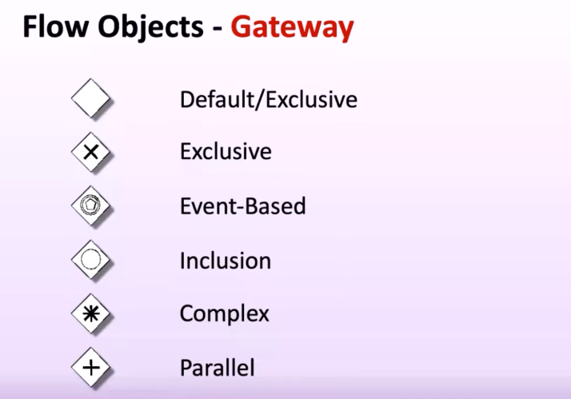
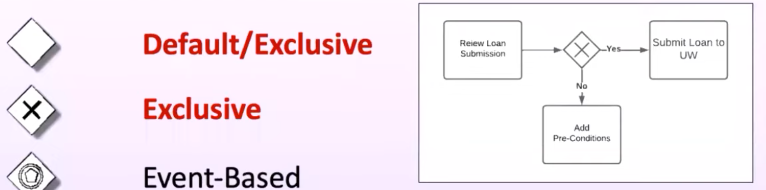
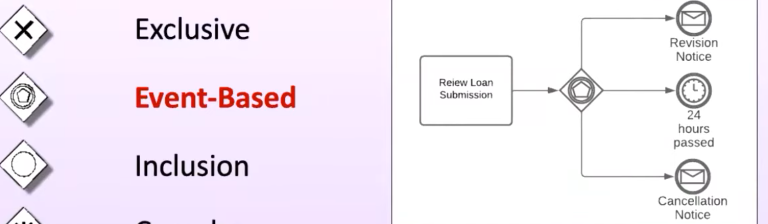
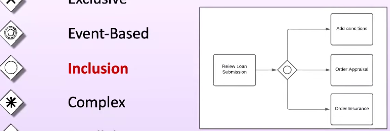
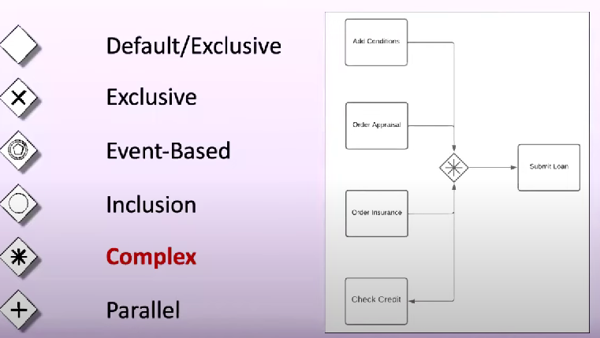
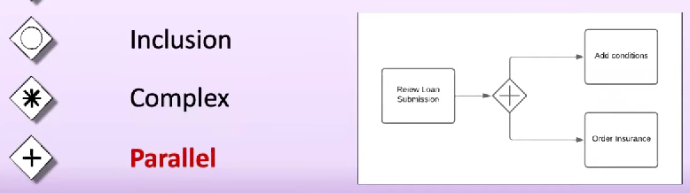

### 2. Connecting Objects

Connecting objects are used to link flow objects together. They include:

- **Sequence Flow**: Shows the order of activities.
- **Message Flow**: Represents communication between participants.
- **Association**: Links artifacts to flow objects.

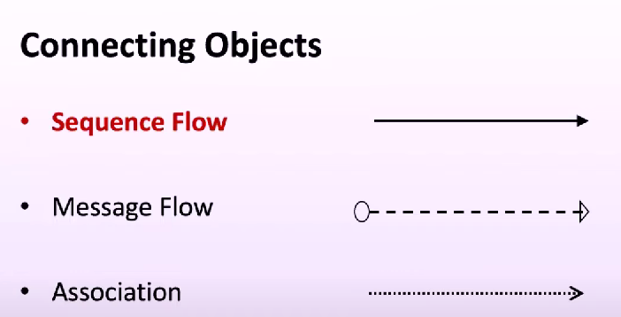

### 3. Artifacts

Artifacts provide additional information about the process. They include:

- **Data Objects**: Represent data used in the process.
- **Group**: Used to group elements together.
- **Annotation**: Provides additional notes or explanations.

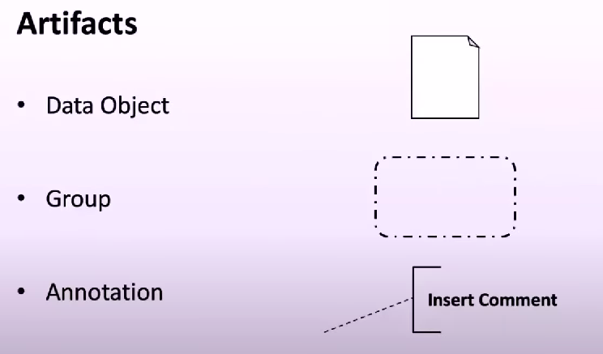

### 4. Participants

Participants represent the different entities involved in the process, such as departments, roles, or systems.

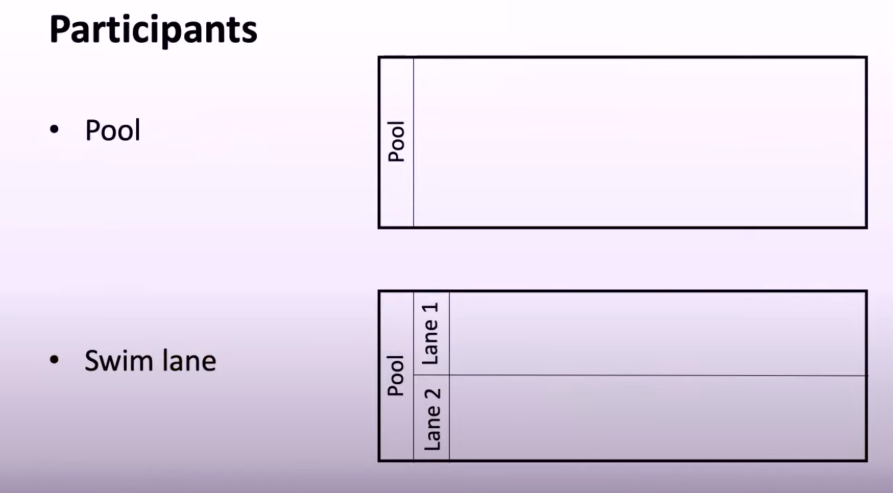

### BPMN Rules

When creating BPMN diagrams, it's important to follow these rules:

1. **Start Event**: Must not have an incoming sequence flow.
2. **End Event**: Must not have an outgoing sequence flow.
3. **Unique Names**: Two end events in a process must not have the same name.
4. **Unique Activities**: Two activities in a process must not have the same name.
5. **Outgoing Flow**: Flow objects outside of end events must have an outgoing flow.
6. **Labeling**: Activities must be labeled with a meaningful verb-noun phrase.
7. **Splitting Gateway**: Must have at least two outgoing flows.
8. **Joining Gateway**: Must have at least two input flows.
9. **Data Objects**: Must not connect to activities through sequence flow lines.
10. **Message Flows**: Must be used for interactions among different pools.

---

UML
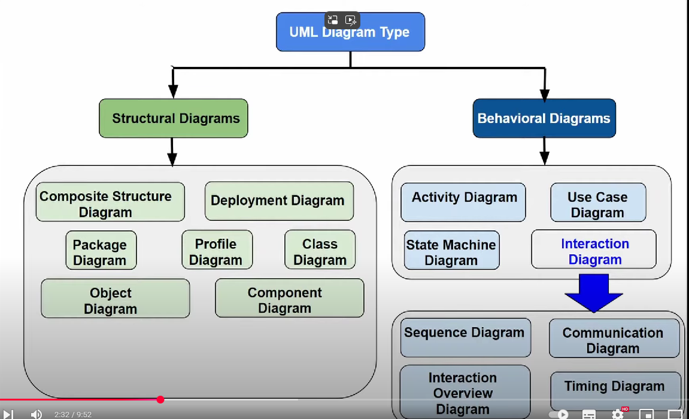

Definition of UML —
•
UML stands for "Unified Modelling Language'
It is a industry-standard graphical language for
specifying, visualizing, constructing, and documenting
the artefacts of software systems.
The UML uses mostly graphical notations to express
the 00 analysis and design of software projects.
Simplifies the complex process of software design.

Why UML for Modelling —
Use graphical notation to communicate more clearl
than natural language (imprecise) and code (too
detailed).
Help acquire an overall view of a system.
UML is not dependent on any one language orl
technology.
UML moves
standardization.
us
tol
from fragmentation
It simplifies software design process.

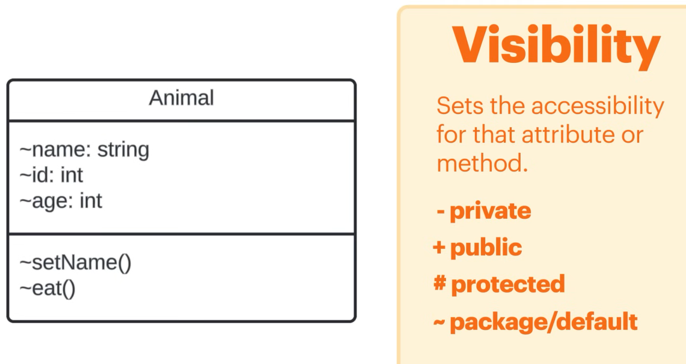

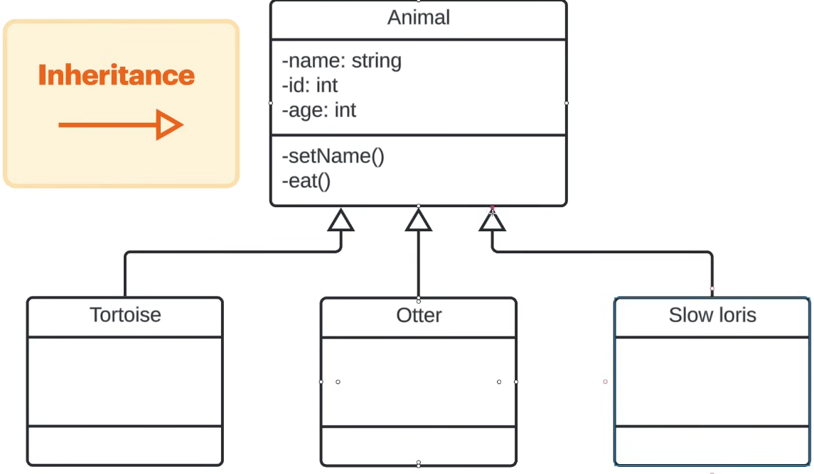

Example for aggregation relation

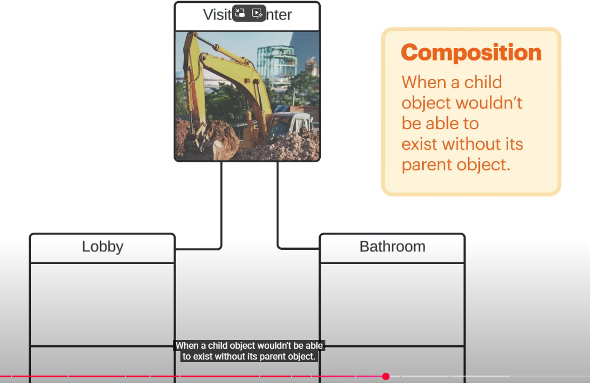

example
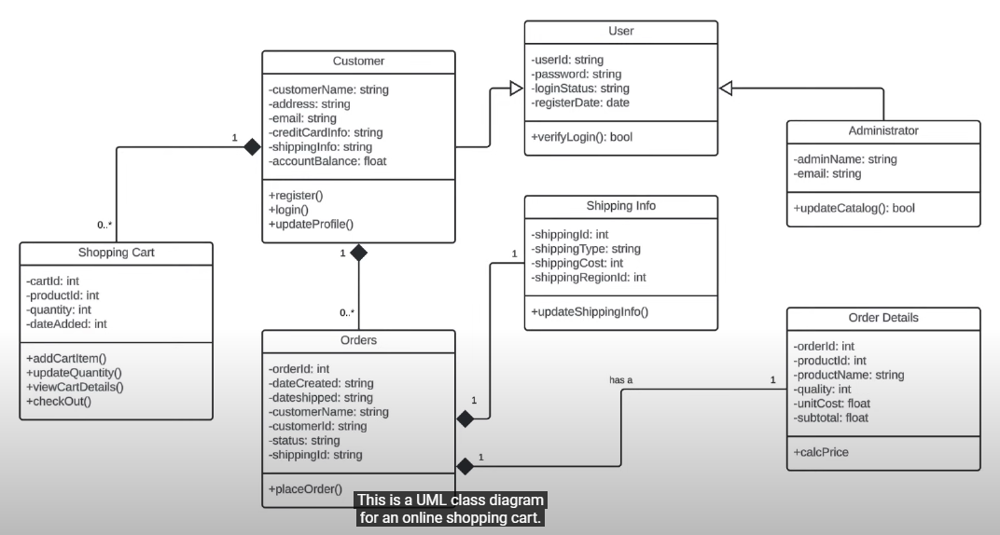

SLDC 
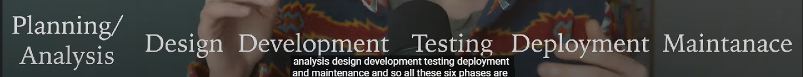